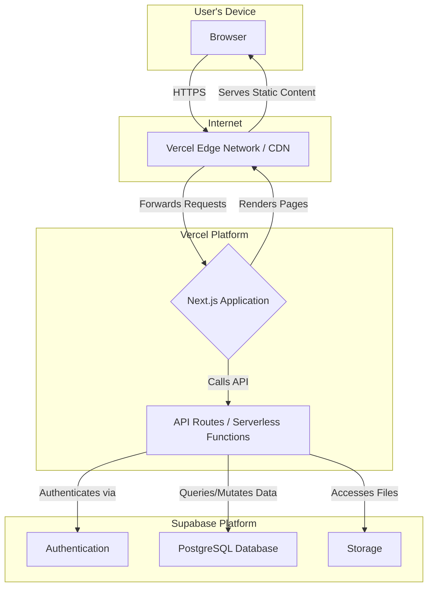
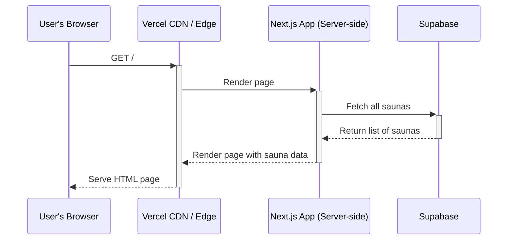
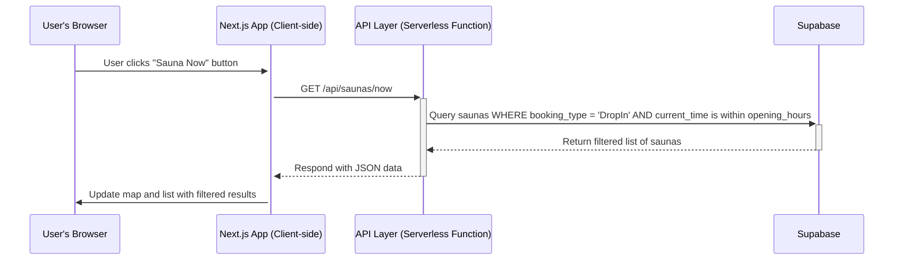

# Stockholm Sauna Directory Fullstack Architecture Document

## Introduction

This document outlines the complete fullstack architecture for the Stockholm Sauna Directory, including backend systems, frontend implementation, and their integration. It serves as the single source of truth for AI-driven development, ensuring consistency across the entire technology stack.

### Starter Template or Existing Project

This is a greenfield project. We will not use a pre-existing template but will initialize the project using standard, industry-best tooling, specifically `create-next-app`, which is the official starter for the Next.js framework chosen in the PRD.

### Change Log

| Date       | Version | Description              | Author  |
| :--------- | :------ | :----------------------- | :------ |
| 2025-06-23 | 1.0     | Initial draft created.   | Winston |

## High Level Architecture

### Technical Summary

The system will be a modern, full-stack web application built on a **Serverless Jamstack** architecture. This approach prioritizes performance, scalability, and developer efficiency. The frontend will be a **Next.js** application, pre-rendering pages for optimal SEO and speed. This will be served globally from Vercel's Edge Network. The backend will leverage a "Backend-as-a-Service" model with **Supabase**, which provides the database, authentication, and instant APIs, supplemented by serverless functions for any custom logic.

### Platform and Infrastructure Choice
* **Platform:** Vercel & Supabase
* **Key Services:**
    * **Vercel:** Hosting, Global CDN, Serverless Functions (for API routes)
    * **Supabase:** PostgreSQL Database, User Authentication, File Storage (for images)
* **Deployment Host and Regions:**
    * **Vercel:** Global Edge Network
    * **Supabase:** `eu-central-1` (Frankfurt)

### Repository Structure
* **Structure:** **Monorepo**
* **Monorepo Tool:** `npm workspaces`
* **Package Organization:** We will have a root `package.json` and separate packages/apps within the repository (e.g., `apps/web` for the Next.js site, `packages/db` for database schemas).

### High Level Architecture Diagram



### Architectural and Design Patterns

* **Jamstack:** The frontend will be a pre-rendered application served from a global CDN, with dynamic functionality provided by APIs.
* **Serverless Functions:** All backend logic will reside in serverless functions (via Next.js API routes).
* **Component-Based UI:** The frontend will be built using reusable React components.
* **Repository Pattern:** We will use a repository pattern to abstract data access logic, making the code cleaner and easier to test.

## Tech Stack

| Category               | Technology                 | Version      | Purpose                                    |
| :--------------------- | :------------------------- | :----------- | :----------------------------------------- |
| **Frontend Language** | TypeScript                 | `5.4.5`      | Type-safe frontend development             |
| **Frontend Framework** | Next.js                    | `14.2.3`     | React framework for production             |
| **UI Library** | React                      | `18.3.1`     | Core of the component-based UI             |
| **Styling** | Tailwind CSS               | `3.4.3`      | Utility-first CSS framework                |
| **Backend/DB** | Supabase                   | `2.43.4` (JS) | Backend-as-a-Service Platform            |
| **Database** | PostgreSQL                 | `15.1`       | Primary relational data store              |
| **Deployment** | Vercel                     | `N/A`        | Hosting, CDN, and Serverless Functions     |
| **Runtime (Vercel)** | Node.js                    | `20.x`       | JavaScript runtime for serverless functions |
| **E2E Testing** | Playwright                 | `1.44.1`     | End-to-end testing framework               |
| **Unit/Integration** | Jest + React Testing Library | `29.7.0`     | Component and function testing             |

## Data Models

### Sauna
```typescript
export enum BookingType { DropIn = "Drop-in welcome", Required = "Online booking required", MembersOnly = "Members only" }
export enum HeatSource { Wood = "Wood-fired", Electric = "Electric" }
export enum SaunaType { Dry = "Finnish Dry", Steam = "Steam Room", Infrared = "Infrared" }
export enum Setting { Lakeside = "Lakeside", Seaside = "Seaside", CitySpa = "City Spa", Gym = "Gym", Rooftop = "Rooftop", Floating = "Floating" }

export interface Sauna {
  id: string; 
  created_at: string;
  name: string;
  address: string;
  gmaps_url?: string;
  website?: string;
  booking_url?: string;
  phone?: string;
  opening_hours: { monday: string; tuesday: string; wednesday: string; thursday: string; friday: string; saturday: string; sunday: string; };
  pricing_details: string;
  booking_type: BookingType; 
  heat_sources: HeatSource[];
  sauna_types: SaunaType[];
  setting: Setting;
  has_lake_access: boolean;
  amenities?: string[];
  swimsuit_policy?: string;
  avg_rating?: number;
  review_count?: number;
}
```

### Submission
```typescript
export enum SubmissionType { NewSuggestion = "new_suggestion", Correction = "correction_report" }
export enum SubmissionStatus { Pending = "pending", Approved = "approved", Rejected = "rejected" }

export interface Submission {
  id: string;
  created_at: string;
  type: SubmissionType;
  status: SubmissionStatus;
  sauna_id?: string; 
  submitted_data: { 
    name?: string;
    address?: string;
    website?: string;
    notes?: string;
    incorrect_fields?: string[];
  };
}
```

## Components
* **1. Web Frontend (Next.js Application):** Responsible for rendering all UI, managing frontend state, and handling user interactions.
* **2. API Layer (Vercel Serverless Functions):** Secure intermediary between the frontend and backend services.
* **3. Supabase Backend:** Handles Authentication, Database (PostgreSQL), and Storage.
* **4. Map Service (External):** Renders the interactive map (e.g., Mapbox).

## External APIs
### Mapbox API
* **Purpose:** To provide the interactive map and geocoding.
* **Documentation:** `https://docs.mapbox.com/`
* **Authentication:** Requires a public access token.

## Core Workflows
### Workflow 1: User Loads the Home Page

### Workflow 2: User Clicks "Sauna Now"


## Database Schema
```sql
CREATE TYPE booking_type_enum AS ENUM ('Drop-in welcome', 'Online booking required', 'Members only');
CREATE TYPE heat_source_enum AS ENUM ('Wood-fired', 'Electric');
CREATE TYPE sauna_type_enum AS ENUM ('Finnish Dry', 'Steam Room', 'Infrared');
CREATE TYPE setting_enum AS ENUM ('Lakeside', 'Seaside', 'City Spa', 'Gym', 'Rooftop', 'Floating');
CREATE TYPE submission_type_enum AS ENUM ('new_suggestion', 'correction_report');
CREATE TYPE submission_status_enum AS ENUM ('pending', 'approved', 'rejected');

CREATE TABLE saunas (
    id UUID PRIMARY KEY DEFAULT gen_random_uuid(),
    created_at TIMESTAMPTZ DEFAULT now() NOT NULL,
    name TEXT NOT NULL,
    address TEXT NOT NULL,
    opening_hours JSONB,
    pricing_details TEXT,
    booking_type booking_type_enum,
    heat_sources heat_source_enum[],
    sauna_types sauna_type_enum[],
    setting setting_enum,
    has_lake_access BOOLEAN DEFAULT FALSE,
    swimsuit_policy TEXT,
    amenities TEXT[],
    gmaps_url TEXT,
    website TEXT,
    booking_url TEXT,
    avg_rating NUMERIC(2, 1),
    review_count INT DEFAULT 0
);

CREATE INDEX idx_saunas_setting ON saunas(setting);
CREATE INDEX idx_saunas_booking_type ON saunas(booking_type);

CREATE TABLE submissions (
    id UUID PRIMARY KEY DEFAULT gen_random_uuid(),
    created_at TIMESTAMPTZ DEFAULT now() NOT NULL,
    type submission_type_enum NOT NULL,
    status submission_status_enum DEFAULT 'pending' NOT NULL,
    sauna_id UUID REFERENCES saunas(id) ON DELETE SET NULL,
    submitted_data JSONB NOT NULL
);

CREATE INDEX idx_submissions_status ON submissions(status);
```

## Unified Project Structure
```plaintext
stockholm-sauna-directory/
├── apps/
│   └── web/
├── packages/
│   ├── db/
│   │   └── migrations/
│   ├── ui/
│   ├── config/
│   └── types/
├── .gitignore
├── package.json
└── README.md
```

## Deployment Architecture
* **Strategy:** Git-based deployment via Vercel. `git push` to `main` deploys to production. PRs create preview deployments.
* **CI/CD Pipeline:** Vercel's built-in pipeline will lint, test, build, and deploy.
* **Environments:** Production (live), Preview (for PRs), and Local.

## Development Workflow
* **Setup:** `git clone`, `npm install`, create `.env.local` with Supabase keys.
* **Commands:** `npm run dev`, `npm test`, `npm run lint`.

## Coding Standards
1.  **Shared Types Only:** Define shared types in `packages/types` and import them.
2.  **Abstract Database Logic:** Use a repository pattern; do not use the Supabase client directly in UI components.
3.  **Centralized Environment Variables:** Access `process.env` only through a dedicated config module.
4.  **Reusable UI Components:** General components go in `packages/ui`; page-specific components go in `apps/web/components`.

## Security and Performance
* **Security:** Use Supabase Row Level Security (RLS) for database access control. Store all secrets as environment variables in Vercel.
* **Performance:** Leverage Next.js's Static Site Generation (SSG) for detail pages and Vercel's Edge Caching for API routes.

## Testing Strategy
* **Unit Tests:** Use Jest & React Testing Library for components.
* **Integration Tests:** Test interactions between components and mocked APIs.
* **E2E Tests:** Use Playwright for critical user flows like filtering and "Sauna Now".

## Error Handling Strategy
* **API:** Use `try...catch` blocks. Log real errors to the server, return a standardized JSON error to the client.
* **Frontend:** Use React Error Boundaries for rendering errors and show user-friendly "toast" notifications for API failures.
